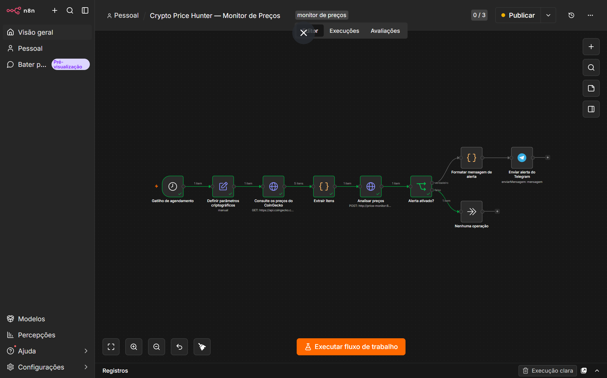
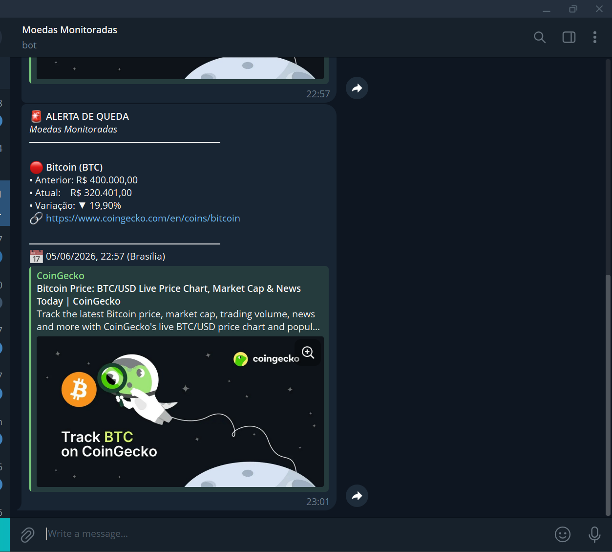

# 📉 Moedas Monitoradas — Crypto Price Hunter

> Pipeline de monitoramento de preços de criptomoedas em tempo real com alertas automáticos via Telegram.

[](https://python.org)
[](https://fastapi.tiangolo.com)
[](https://n8n.io)
[](https://postgresql.org)
[](https://docker.com)
[](https://www.coingecko.com/en/api)

Sistema automatizado que rastreia preços de criptomoedas a cada hora e envia alertas no Telegram sempre que uma moeda registra queda brusca. Construído com arquitetura de microsserviços em Docker, separando orquestração (n8n), processamento (FastAPI) e persistência (PostgreSQL).

---

## 📸 Screenshots

<table>
  <tr>
    <td align="center"><b>Workflow no n8n</b></td>
    <td align="center"><b>Alerta no Telegram</b></td>
  </tr>
  <tr>
    <td></td>
    <td></td>
  </tr>
</table>

---

## 🏗️ Arquitetura

```
┌─────────────────────────────────────────────────────────────────────────┐
│                     projetos_shared  (Docker Network)                   │
│                                                                         │
│  ┌─────────────────┐    ┌──────────────────┐    ┌──────────────────┐   │
│  │  n8n            │    │  CoinGecko API   │    │  PostgreSQL 16   │   │
│  │  Orquestrador   │───▶│  api.coingecko   │    │  :5432           │   │
│  │  :5678          │    │  .com (externa)  │    │  price_history   │   │
│  └────────┬────────┘    └────────┬─────────┘    └────────▲─────────┘   │
│           │                      │                        │             │
│           │              preços em BRL                    │             │
│           │           (BTC, ETH, SOL...)                  │             │
│           │                      │                        │             │
│           │             ┌────────▼──────────┐             │             │
│           └────────────▶│  FastAPI          │─────────────┘             │
│                         │  price-monitor    │  INSERT price_history      │
│                         │  :8001            │                           │
│                         └────────┬──────────┘                           │
│                                  │                                      │
│                     queda ≥ ALERT_THRESHOLD_PCT ?                       │
│                                  │                                      │
│                    ┌─────────────┴─────────────┐                        │
│                    │ Sim                        │ Não                   │
│                    ▼                            ▼                       │
│           ┌────────────────┐          ┌─────────────────┐               │
│           │  n8n Telegram  │          │  No Operation   │               │
│           │  Alerta enviado│          │  (silencioso)   │               │
│           └────────────────┘          └─────────────────┘               │
└─────────────────────────────────────────────────────────────────────────┘
```

---

## 🔄 Fluxo do Pipeline

```
Schedule Trigger (1h)
        │
        ▼
Set Crypto Params ──── lê CRYPTO_IDS e CRYPTO_LIMIT do ambiente
        │
        ▼
Fetch CoinGecko Prices ──── GET /coins/markets?vs_currency=brl&ids=...
        │
        ▼
Extract Items ──── mapeia resposta para formato interno
        │
        ▼
Analyze Prices ──── POST /webhook/analyze → FastAPI
        │              ├── busca último preço no PostgreSQL
        │              ├── calcula variação percentual
        │              ├── insere novo registro
        │              └── retorna { has_alert, alerts[] }
        │
        ▼
     Has Alert?
    /          \
  Sim          Não
   │            │
   ▼            ▼
Format Alert   No Operation
Message
   │
   ▼
Send Telegram Alert ──── mensagem formatada em Markdown
```

---

## 🛠️ Stack de Tecnologias

| Camada         | Tecnologia           | Função                                      |
|----------------|----------------------|---------------------------------------------|
| Orquestração   | **n8n**              | Agendamento, chamadas HTTP, lógica de fluxo |
| API de dados   | **CoinGecko API**    | Preços em tempo real (gratuita, sem auth)   |
| Backend        | **FastAPI + Python** | Lógica de alerta e persistência             |
| Banco de dados | **PostgreSQL 16**    | Histórico de preços                         |
| Mensageria     | **Telegram Bot API** | Envio de alertas formatados                 |
| Container      | **Docker Compose**   | Orquestração e isolamento de serviços       |
| Rede           | **projetos_shared**  | Rede Docker compartilhada entre projetos    |

---

## 📦 Pré-requisitos

A infraestrutura compartilhada precisa estar rodando antes de subir este projeto:

```bash
cd ../infra
docker compose up -d
```

| Serviço    | Host (interno) | Porta |
|------------|----------------|-------|
| PostgreSQL | `postgres`     | 5432  |
| n8n        | `n8n`          | 5678  |
| pgAdmin    | `pgadmin`      | 5050  |

---

## 🚀 Setup

### 1. Variáveis de ambiente

```bash
cp .env.example .env
```

```dotenv
# PostgreSQL
DB_HOST=postgres
DB_PORT=5432
DB_USER=airflow
DB_PASSWORD=airflow
DB_NAME=airflow

# Moedas monitoradas — IDs do CoinGecko separados por vírgula
# Lista completa: https://api.coingecko.com/api/v3/coins/list
CRYPTO_IDS=bitcoin,ethereum,solana,cardano,chainlink
CRYPTO_LIMIT=5

# Percentual de queda para disparar alerta (-10.0 = queda de 10%)
ALERT_THRESHOLD_PCT=-10.0

# Telegram Bot
TELEGRAM_BOT_TOKEN=seu_token_aqui
TELEGRAM_CHAT_ID=seu_chat_id_aqui
```

### 2. Subir o serviço

```bash
docker compose up --build -d
curl http://localhost:8001/health
# {"status":"ok"}
```

### 3. Importar o workflow no n8n

1. Acesse **http://localhost:5678**
2. **Workflows → Import from file** → selecione `n8n/workflow.json`
3. No nó **Send Telegram Alert**, configure a credencial do Telegram
4. Ative o workflow pelo toggle

### 4. Configurar Telegram

1. Crie um bot com o [@BotFather](https://t.me/botfather) e copie o token
2. Envie uma mensagem para o bot, depois acesse:
   ```
   https://api.telegram.org/bot<TOKEN>/getUpdates
   ```
3. Localize o campo `"chat": { "id": XXXXXXX }` — esse é o seu `TELEGRAM_CHAT_ID`

---

## 🪙 Moedas monitoradas (padrão)

| Moeda     | ID CoinGecko | Símbolo |
|-----------|--------------|---------|
| Bitcoin   | `bitcoin`    | BTC     |
| Ethereum  | `ethereum`   | ETH     |
| Solana    | `solana`     | SOL     |
| Cardano   | `cardano`    | ADA     |
| Chainlink | `chainlink`  | LINK    |

---

## 📡 API Reference

### `GET /health`
```json
{ "status": "ok", "ts": "2026-06-05T00:00:00.000000" }
```

### `POST /webhook/analyze`

**Request:**
```json
{
  "items": [{ "id": "bitcoin", "title": "Bitcoin (BTC)", "price": 320401.00,
              "currency_id": "BRL", "permalink": "https://www.coingecko.com/en/coins/bitcoin", "seller": {} }],
  "query": "crypto-brl"
}
```

**Response — com alerta:**
```json
{
  "processed": 1, "has_alert": true,
  "alerts": [{ "product_id": "bitcoin", "title": "Bitcoin (BTC)",
               "previous_price": 400000.00, "current_price": 320401.00,
               "variation_pct": -19.90, "permalink": "https://www.coingecko.com/en/coins/bitcoin" }]
}
```

---

## 🗄️ Esquema do Banco

```sql
CREATE TABLE IF NOT EXISTS price_history (
    id               SERIAL PRIMARY KEY,
    product_id       VARCHAR(50)    NOT NULL,
    product_title    TEXT           NOT NULL,
    price            NUMERIC(18, 2) NOT NULL,
    currency_id      VARCHAR(10)    NOT NULL DEFAULT 'BRL',
    permalink        TEXT,
    variation_pct    NUMERIC(8, 4),
    alerted          BOOLEAN        NOT NULL DEFAULT FALSE,
    searched_at      TIMESTAMP      NOT NULL DEFAULT NOW()
);
```

---

## 📁 Estrutura

```
moedas-monitoradas/
├── src/
│   ├── app.py           # FastAPI — /health e /webhook/analyze
│   ├── database.py      # Conexão PostgreSQL
│   └── sql/schema.sql   # DDL da tabela price_history
├── n8n/
│   └── workflow.json    # Workflow exportado (importar via UI do n8n)
├── docs/
│   ├── n8n-workflow.png     # Screenshot do pipeline no n8n
│   └── telegram-alert.png  # Screenshot do alerta no Telegram
├── Dockerfile
├── docker-compose.yaml
├── .env.example
└── README.md
```

---

## ⚙️ Como Estender

| Objetivo                             | Como fazer                                |
|--------------------------------------|-------------------------------------------|
| Adicionar novas moedas               | `CRYPTO_IDS` no `.env` + restart n8n     |
| Monitorar em USD ou EUR              | Parâmetro `vs_currency` no workflow      |
| Trocar canal de alerta (Slack, etc.) | Substituir nó Telegram no workflow       |
| Alterar limiar de queda              | `ALERT_THRESHOLD_PCT` no `.env`          |
| Criar dashboard de preços            | Conectar Metabase/Grafana ao PostgreSQL  |
| Monitorar alta de preço também       | Adicionar condição positiva no FastAPI   |

---

## 📄 Licença

Projeto de estudo — livre para uso e modificação.
